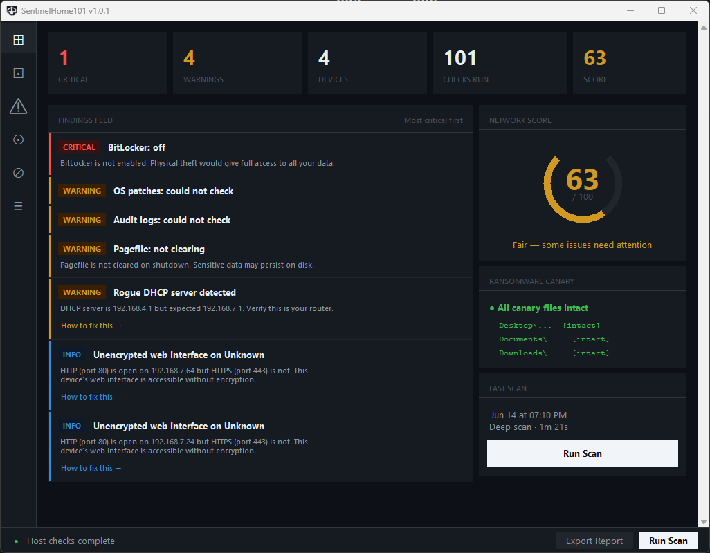

# SentinelHome101

**101-point home network and computer security audit for Windows.**

SentinelHome101 discovers every device on your network, runs 101 security checks against your machine and network configuration, and delivers every finding in plain English with step-by-step guidance to fix it.

No IT background required. No cloud. No subscription.

---



---

## Download

**[→ Download SentinelHome101.exe](https://github.com/SentinelHome101/SentinelHome101/releases/latest/download/SentinelHome101.exe)**

Version 1.0.1 · Windows 10 / 11 (64-bit) · No Python required

---

## What It Does

| Category | Checks | Description |
|---|---|---|
| Endpoint Security | 15 | Antivirus, BitLocker, Secure Boot, OS patches, user accounts, Windows Defender |
| Network Perimeter | 15 | WiFi security, router credentials, DNS hijacking, firewall, TLS, UPnP |
| Threat Detection | 11 | Botnet behavior, ARP spoofing, rogue DHCP, ransomware canary files |
| Device & Exposure | 18 | Every network device identified by manufacturer, IP, MAC, open ports |
| Monitoring & History | 24 | Scan history, change detection, inactive devices, performance baseline |
| Reporting | 18 | HTML, TXT, CSV export. Plain-English remediation for every finding |

---

## System Requirements

- Windows 10 or Windows 11 (64-bit)
- Administrator rights (prompted automatically on launch)
- No Python or other software required — the exe is self-contained

---

## Installation

1. Download `SentinelHome101.exe` from the [Releases](https://github.com/SentinelHome101/SentinelHome101/releases) page
2. Double-click the exe
3. Click **Yes** on the UAC prompt (Administrator rights required for security checks)
4. Read and accept the first-run disclosure
5. Click **Run Scan**

No installer. No setup wizard. No registry modifications.

### Windows SmartScreen

SentinelHome101 v1.0.1 is signed with a verified publisher certificate. If SmartScreen appears, click **More info** then **Run anyway**. SmartScreen reputation builds over time as more users download the signed build. Full source code is available in this repository for independent review.

---

## Security & Transparency

SentinelHome101 is a network security audit tool. It reads Windows registry settings, runs network commands (netstat, arp, ipconfig), scans your local subnet, and probes open ports. Automated sandbox tools may flag this behavior — this is expected for any security scanner.

**VirusTotal scan — v1.0.1: 71/71 engines clean**
[→ View VirusTotal report](https://www.virustotal.com/gui/file/b2d7336fc22f921e7554ae6bebed613e959fd0d45f210ef67f56462380f2a266)

Major engines including Microsoft Defender, Kaspersky, and Bitdefender all returned clean. The signed build eliminated all previous heuristic flags from the unsigned v1.0.0 build.

All source code is in this repository. You can read it, compile it yourself, or have someone you trust review it independently.

---

## Privacy

- All 101 checks run entirely on your local machine and network
- No scan results, device data, or personal information is transmitted anywhere
- Two opt-in features connect to external services (speed test, credential breach check) — both disabled by default
- Full privacy policy: [sentinelhome101.com/privacy.html](https://sentinelhome101.com/privacy.html)

---

## Data Storage

All data is stored locally at:
```
C:\Users\[YourName]\AppData\Roaming\SentinelHome101\
```
This folder contains your scan history, device database, settings, and ransomware canary files. It is never transmitted anywhere.

---

## Uninstalling

SentinelHome101 does not use a traditional installer and does not write to the Windows registry. To remove it completely:

1. Delete `SentinelHome101.exe`
2. Delete `C:\Users\[YourName]\AppData\Roaming\SentinelHome101\`

Nothing else is left behind.

---

## Documentation

Full documentation is in the `Documentation/files/` folder:

- [Installation Guide](Documentation/files/Installation_Guide.docx)
- [User Manual](Documentation/files/User_Manual.docx)
- [FAQ](Documentation/files/FAQ.docx)
- [Privacy Policy](Documentation/files/Privacy_Policy.docx)
- [EULA](Documentation/files/EULA.docx)
- [Changelog](Documentation/files/Changelog.docx)

---

## Support

**Email:** support@sentinelhome101.com  
**Website:** [sentinelhome101.com](https://sentinelhome101.com)  
**Issues:** [GitHub Issues](https://github.com/SentinelHome101/SentinelHome101/issues)

---

## Disclaimer

SentinelHome101 is provided as-is without warranty of any kind. It is a diagnostic and reporting tool only — it does not modify your system or network configuration. See [EULA](Documentation/files/EULA.docx) for full terms.
